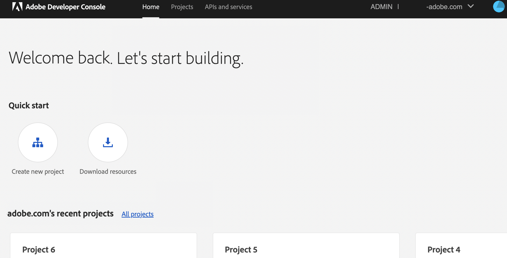
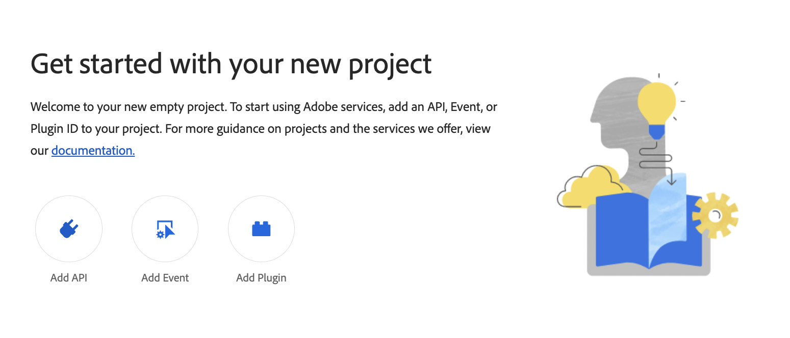
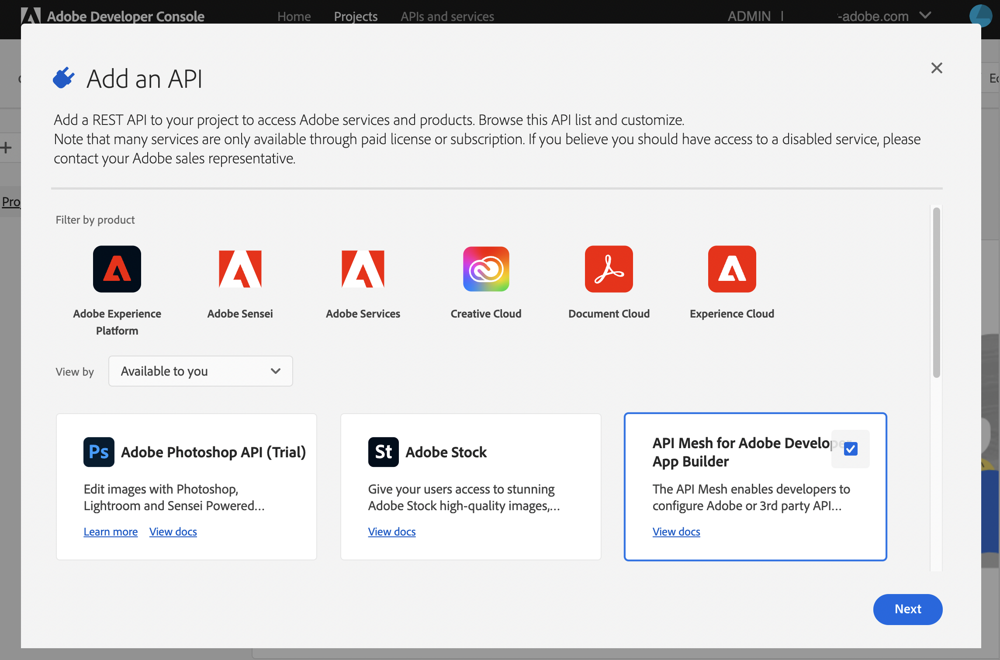
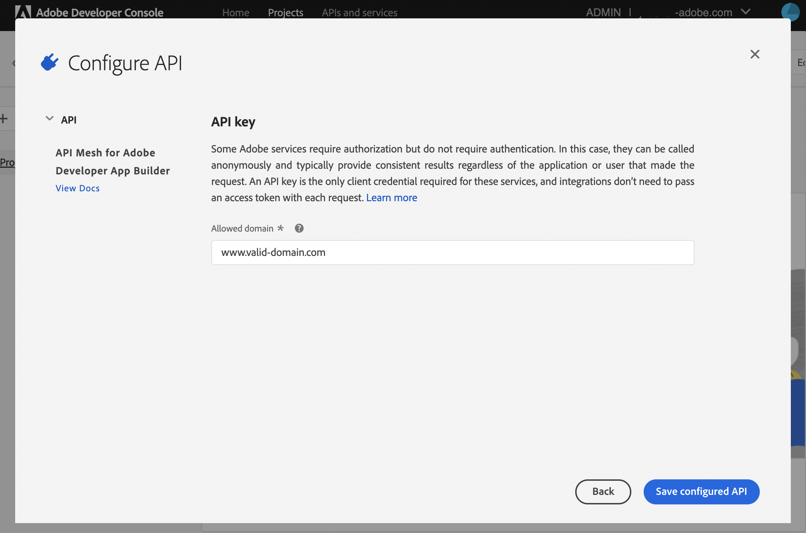
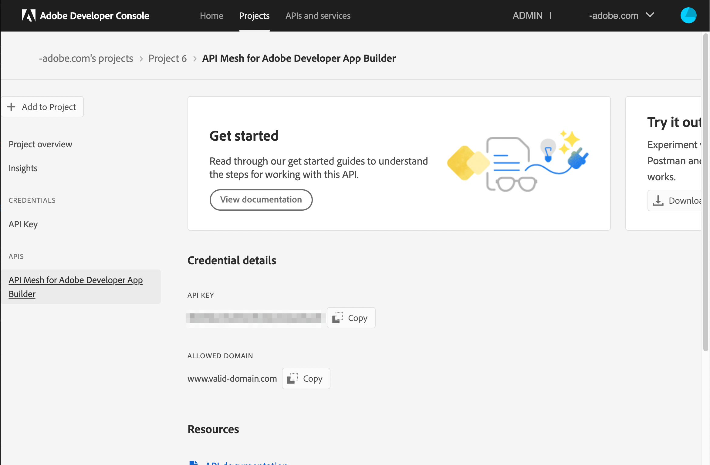

# Create a mesh

This page provides the basic steps for creating your first mesh.

## Requirements

Before creating a mesh, create a project or a templated project and workspace for the mesh. For other requirements see [Prerequisites].

### Create a project

When you [create a mesh], you must assign the mesh to a specific project. To create a new project, log in to the [Adobe Developer Console] and [create a project].

### Add a workspace to your project

If you are [creating a templated project], you can add [workspaces]. Workspaces allow you to create separate environments. You can also create workspaces for each developer on your team.

<InlineAlert variant="info" slots="text"/>

When creating or updating a mesh, the file to upload must have the `.json` filename extension.

Workspaces that already have an API mesh will have "API Mesh" displayed on their workspace card in the developer console.


## Create a mesh

1. Create and save a JSON configuration file that defines the properties of your mesh. Your mesh is defined by a combination of [handlers] and [transforms]. In this example, the file name is `mesh.json`.

  The following mesh file can be used with minimal setup to access the endpoint of the [Venia] demo store.

  ``` json
  {
  "meshConfig": {
      "sources": [
        {
          "name": "Commerce",
          "handler": {
            "graphql": {
              "endpoint": "https://venia.magento.com/graphql/"
            }
          }
        }
      ]
    }
  }
  ```

1. Run the login command and provide your credentials in the browser window.

    ```bash
    aio auth:login
    ```

1. Run the following command to create a mesh. In this example, the file name is `mesh.json`.

    ```bash
    aio api-mesh:create mesh.json
    ```

1. If you have not already [selected a project and workspace manually](#select-a-project-or-workspace), choose the organization, project, and workspace that you want to create the mesh in. If you do not have a project, see [Create a project](#create-a-project).

  You will also need to indicate if you want to automatically select the specified organization and workspace in the future. If you answer **Yes** to either of these prompts and you want to select an organization or workspace other than the cached organization and workspace. You can use the `-i` or `-ignoreCache` flag to clear the cache and allow you to select another organization and workspace. You can also manually [modify the selected project or workspace](#modify-projects-and-workspaces).

  **Note:** Each workspace within a project can only have one mesh associated with it at a time.

1. When you are prompted to confirm that you want to create a mesh, select **Yes**. If you want to automatically confirm the creation, add the `-c` or `--autoConfirmAction` flag to your create command.

  The `aio api-mesh:create` response assigns you a `meshId`, an `apiKey`, and provides a GraphQL endpoint that you can use to query your mesh.

<InlineAlert variant="info" slots="text"/>

Refer to the [command reference] for a detailed description of `aio api-mesh:create`.

### Create a mesh from a source

The `aio api-mesh:source` commands provide several prebuilt mesh sources that you can use to create your mesh file, for example `mesh.json`. Each source contains a mesh configuration file designed for a specific first or third-party source. Third-parties can submit their sources as a pull request to the [api-mesh-sources](https://github.com/adobe/api-mesh-sources) repo. Once approved, these sources will be available for selection in the CLI.

Currently this feature serves as a way for you to quickly copy an example mesh.

1. To choose a prebuilt source from a list, run the following command:

  ```bash
  aio api-mesh:source:discover
  ```

  **Note**: Alternatively, you can use the [aio api-mesh:source:install](./command-reference.md#aio-api-meshsourceinstall) command if you know the source you want to install.

1. Use the arrow keys to select which source you want to copy and press Enter. You can use the Spacebar to select multiple sources.

1. Confirm that you want to print the configuration in the console. The mesh configuration prints in your terminal and is automatically copied to your clipboard depending on your selections.

1. Review the mesh configuration. When you are ready to install the mesh configuration, run the `aio api-mesh:source:install` command followed by the `"<source_name>"` you want to install, for example:

```bash
aio api-mesh:source:install "AEM Assets API"
```

<InlineAlert variant="info" slots="text"/>

Alternatively, you can use the [aio api-mesh:source:get](./command-reference.md#aio-api-meshsourceget) command to print the source in the terminal or copy the source to the clipboard.

Refer to the [Command reference](command-reference.md#aio-api-meshsourceinstall) flags to learn how to replace variables in the source mesh configuration.

### Access the gateway

The `aio api-mesh:create` response automatically assigns you an API key and subscribes that API key to the mesh service. You can also retrieve the API key by viewing the project in the [Adobe Developer Console].

After you [create a mesh], you can access the GraphQL endpoint in any GraphQL browser by modifying the following URL: `https://graph.adobe.io/api/<meshId>/graphql?api_key=<your_apiKey>`

The `aio api-mesh:create` response provides the exact url to access the gateway for your mesh.

## Mesh example

The following example adds both an Adobe Commerce instance (with Live Search enabled) and an Adobe Experience Manager instance to the mesh. The GraphQL endpoints for Commerce and Live Search are different, therefore you must configure them separately.

```json
    {
      "meshConfig": {
        "sources": [
          {
            "name": "Commerce",
            "handler": {
              "graphql": {
                "endpoint": "https://<your_commerce_site>/graphql/"
              }
            }
          },
          {
            "name": "AEM",
            "handler": {
              "graphql": {
                "endpoint": "https://<your_AEM_site>/endpoint.json"
              }
            }
          },
          {
            "name": "LiveSearch",
              "handler": {
                "graphql": {
                  "endpoint": "https://<your_commerce_site>/search/graphql",
                  "operationHeaders": {
                    "x-api-key": "search_gql",
                    "Magento-Environment-Id": "<your_environment_id>",
                    "Magento-Website-Code": "base",
                    "Content-Type": "application/json",
                    "Magento-Store-Code": "main_website_store",
                    "Magento-Store-View-Code": "default"
                  },
                  "schemaHeaders": {
                    "x-api-key": "search_gql",
                    "Magento-Environment-Id": "<your_environment_id>",
                    "Magento-Website-Code": "base",
                    "Content-Type": "application/json",
                    "Magento-Store-Code": "main_website_store",
                    "Magento-Store-View-Code": "default"
                  }
                }
              }
            }
          ]
        }
    }
```

## Update an existing mesh

If you make any changes to your mesh file, such as adding [transforms], you must publish them before the changes will be reflected in your gateway. The following command will update the mesh in the selected workspace with the settings specified in the `update-mesh.json` file.

```bash
aio api-mesh:update update-mesh.json
```

```json
    {
      "meshConfig": {
        "sources": [
          {
            "name": "Commerce",
            "handler": {
              "graphql": {
                "endpoint": "https://<your_commerce_site>/graphql/"
              }
            }
          },
          {
            "name": "AEM",
            "handler": {
              "graphql": {
                "endpoint": "https://<your_AEM_site>/endpoint.json"
              }
            }
          },
          {
            "name": "LiveSearch",
              "handler": {
                "graphql": {
                  "endpoint": "https://<your_commerce_site>/search/graphql",
                  "operationHeaders": {
                    "x-api-key": "search_gql",
                    "Magento-Environment-Id": "<your_environment_id>",
                    "Magento-Website-Code": "base",
                    "Content-Type": "application/json",
                    "Magento-Store-Code": "main_website_store",
                    "Magento-Store-View-Code": "default"
                  },
                  "schemaHeaders": {
                    "x-api-key": "search_gql",
                    "Magento-Environment-Id": "<your_environment_id>",
                    "Magento-Website-Code": "base",
                    "Content-Type": "application/json",
                    "Magento-Store-Code": "main_website_store",
                    "Magento-Store-View-Code": "default"
                  }
                }
              }
            }
          ]
        }
    }
```

## Modify projects and workspaces

<InlineAlert variant="info" slots="text"/>

When creating a mesh for the first time, you must select the project and workspace that you want to create the mesh in. Alternatively, you can use [aio commands](https://github.com/adobe/aio-cli#commands) to manually select a project or workspace, list the current selections, or remove the currently selected project or workspace from the cache.

### View the cached project and workspace

To see your current cache configuration, use the [`aio config:get console`](https://github.com/adobe/aio-cli#aio-configget-key) command, which includes the currently selected organization, project, and workspace.

You can view a list of available projects in your current organization by running the [`aio console:project:list`](https://github.com/adobe/aio-cli-plugin-console#aio-consoleprojectlist) command.

To view a list of available workspaces in the current project, run the [`aio console:workspace:list`](https://github.com/adobe/aio-cli-plugin-console#aio-consoleworkspacelist) command.

### View your mesh in the Adobe Developer Console

As an alternative to running the [`aio api-mesh:get`](./command-reference.md#aio-api-meshget) command, you can view your mesh details by selecting the **API Mesh** section in the desired workspace in the [Adobe Developer Console].

On the API Mesh Details screen, you can use the tabs to view different segments of your mesh.


To download a copy of your mesh file, click the **Download Mesh Schema** button at the top of the API Mesh Details screen.


### Select a project or workspace

By [default](https://developer.adobe.com/app-builder/docs/getting_started/first_app/#2-creating-a-new-project-on-developer-console) projects have a `production` and a `stage` workspace. You can also [create your own workspaces](https://developer.adobe.com/developer-console/docs/guides/projects/projects-template/#add-a-workspace). If you do not know which workspace to use, use the `stage` workspace.

To change the selected project, use the [`aio console:project:select`](https://github.com/adobe/aio-cli#aio-consoleprojectselect-projectidorname) command, which will prompt you to select your project from a list.

To change the selected workspace, use the [`aio console:workspace:select`](https://github.com/adobe/aio-cli#aio-consoleworkspaceselect-workspaceidorname) command, which will prompt you to select your workspace from a list.

<InlineAlert variant="info" slots="text"/>

You must select a project before you select a workspace.

### Delete a cached project or workspace

If you want to clear a previously selected project or workspace from your cache, use the [`aio config:delete`](https://github.com/adobe/aio-cli#aio-configdelete-keys) followed by the object you want to remove from your cached config.

For example:

-  `aio config:delete console.project` Removes the current project from the cache.
-  `aio config:delete console.workspace` Removes the current workspace from the cache.

## Retrieve a previously created `meshId`

If you need to retrieve a `meshId` from a previously created mesh, use the following command:

```bash
aio api-mesh:describe
```

The command returns a list of projects. Use the arrow and enter keys to select your project and organization. Alternatively, you can type to search for your project and workspace. The console then displays details about the project.

## Manually create an API Key (optional)

<InlineAlert variant="warning" slots="text"/>

API keys are now automatically generated and associated with your project as part of the mesh creation process. Use the following process if you need to manually add an API to a project.

<InlineAlert variant="info" slots="text"/>

Only mesh owners can create API Keys. If you do not have access to [Adobe Developer Console], contact your mesh owner.

To access the gateway and perform GraphQL queries, you need to provide an API Key to authorize access to your mesh. To create your API Key:

1. In [Adobe Developer Console], select the desired organization from the dropdown in the top-right corner.

    

1. Select an existing project or [create a new one](#create-a-project).

1. Inside the project, click **Add API**.

    

1. Select **API Mesh for Adobe Developer App Builder** and click **Next**.

    

1. The **Allowed Domain** field is not currently enforced. Enter any valid test domain to proceed.

    

1. Click **Save configured API**. Copy your **API Key** from the Project Overview page.

    

You can return to the Project Overview page whenever you need to retrieve your API Key.

## Stage to production

To move a mesh in the `stage` workspace to the `production` workspace:

1. [Retrieve](#retrieve-a-previously-created-meshid) your previously created mesh by running the following command with the desired project and workspace selected.

  ```bash
  aio api-mesh:describe
  ```

1. Copy and paste the described mesh into a new `.json` file and save it.

1. Select the `production` workspace or [select another project and workspace](#select-a-project-or-workspace) combination for your destination.

1. Run the [create](#create-a-mesh) command and reference the previously created file.

    ```bash
    aio api-mesh:create mesh.json
    ```

<!-- Link Definitions -->
[handlers]: source-handlers.md
[transforms]: transforms.md
[venia]: https://developer.adobe.com/commerce/pwa-studio/guides/packages/venia/
[Adobe Developer Console]: https://developer.adobe.com/console
[create a project]: https://developer.adobe.com/developer-console/docs/guides/projects/#create-a-new-project
[create a mesh]: create-mesh.md
[creating a templated project]: https://developer.adobe.com/developer-console/docs/guides/projects/projects-template/
[workspaces]: https://developer.adobe.com/developer-console/docs/guides/projects/projects-template/#workspaces
[Prerequisites]: ./getting-started.md#prerequisites
[command reference]: ./command-reference.md#aio-api-meshcreate
