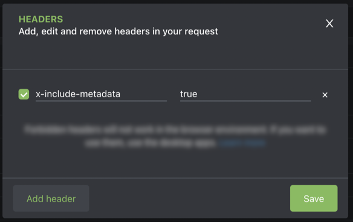

# Headers

To specify headers for your mesh, you can add them inside the `JSON` file that describes your mesh, or you can add them when querying. Currently, you can add [request headers](#request-headers) and [response headers](#response-headers), which both can contain [cache-control headers](cache-control-headers.md).

## Request headers

Request headers provide more information about the request context. Currently, you can add request headers to your [mesh config](#add-request-headers-in-your-mesh-file) or add them [at runtime](#add-or-update-request-headers-at-runtime).

### Add request headers in your mesh file

To add headers directly to a source handler in your mesh file, for example `mesh.json`, add the `operationHeaders` object with key-value pairs for your headers. The following example defines the `Store` header for the Commerce source and multiple headers for the LiveSearch source.

```json
{
  "meshConfig": {
    "sources": [
      {
        "name": "Commerce",
        "handler": {
          "graphql": {
            "endpoint": "https://<host>/graphql",
            "operationHeaders": {
              "Store": "default"
            }
          }
        }
      },
      {
        "name": "LiveSearch",
        "handler": {
          "graphql": {
            "endpoint": "https://<host>/search/graphql",
            "operationHeaders": {
              "Magento-Environment-Id": "<environment_id>",
              "Magento-Website-Code": "base",
              "Magento-Store-Code": "main_website_store",
              "Magento-Store-View-Code": "default",
              "X-Api-Key": "search_gql"
            }
          }
        }
      }
    ]
  },
}
```

You can also inject dynamic values from the context into your headers. For examples of dynamic header values, select a handler:

-  [OpenAPI handlers](../reference/handlers/openapi.md#dynamic-header-values)
-  [GraphQL handlers](../reference/handlers/graphql.md#dynamic-header-values)
-  [JSON schema handlers](../reference/handlers/json-schema.md#dynamic-header-values)

### Add or update request headers at runtime

When you use GraphiQL or another tool to interact with your mesh, you can add headers at runtime that are passed through the mesh to the specified handler by using the following format:

-  **Key**: `GGW-SH-<SourceName>-<HeaderName>`

Using this example, the components of the header name are:

-  `GGW-SH` is a required string that indicates to the GraphQL Gateway Server that what follows is a source header.
-  `SourceName` is the name of your previously created source or handler. The source names in the example in the previous section are `Commerce` and `LiveSearch`.
-  `HeaderName` is the name of the header you are adding or modifying. Remember to add a corresponding value for your header.

#### Override a default value

Consider a scenario where the value of the `Store` header defined in the previous example is the store view with the most traffic. However, you have additional store views that allow international customers to shop in their native languages and currencies. You can override the predefined value for your UK store view by sending the following header information with your request:

-  **Key**: `GGW-SH-Commerce-Store`
   -  **Value**: `uk`

#### Add a header to all sources

To send a header to all sources in your mesh, you can replace the source handler name with `*`. For example:

-  **Key**: `GGW-SH-*-trackingId`
   -  **Value**: `new-trackingId`

This can be useful for authorization, authentication, and tracking headers that could be the same across multiple sources. To apply a header to all sources except one, specify that source separately. For example:

-  **Key**: `GGW-SH-*-trackingId`
   -  **Value**: `new-trackingId`
-  **Key**: `GGW-SH-differentSource-trackingId`
   -  **Value**: `different-trackingId`

## Response headers

Response headers provide detailed context of the response. Currently, you can only add response headers from the mesh config.

<InlineAlert variant="info" slots="text"/>

All response header names must be unique. Conflicting header names will result in an error when you try to create or update a mesh.

### Add response headers in your mesh file

Mesh owners can use the `responseConfig.headers` object to add response headers. Define each header as a key-value pair.

``` json
    { 
      "meshConfig": { 
        "sources": [
          {
            "name": "venia", 
            "handler": { 
              "graphql": { 
                "endpoint": "https://venia.magento.com/graphql"
              } 
            } 
          }
        ],
       "responseConfig": {
        "headers": {
            "Cache-Control": "max-age=60480",
            "Vary": "Accept"
          }
        }
      }
    }
```

#### Return forwarded headers

The `responseConfig.headers` object also allows you to return header values from a source. The following example requests the `X-Magento-Cache-Id` and `X-Cache` headers from the Venia source.

<InlineAlert variant="info" slots="text"/>

[JSON schema handlers](../reference/handlers/json-schema.md) do not support `responseConfig` functionality.

```json
{
  "meshConfig": {
    "sources": [
      {
        "name": "venia",
        "handler": {
          "graphql": {
            "endpoint": "https://venia.magento.com/graphql"
          }
        },
        "responseConfig": {
          "headers": [
            "X-Magento-Cache-Id",
            "X-Cache"
          ]
        }
      }
    ]
  }
}
```

#### Conflicting headers

When forwarding headers, an error occurs if two or more sources return a header with the same name. To view all headers, regardless of source, add the `x-include-metadata` header with a value of `true` in your GraphQL client.



Including metadata prefixes the returned response headers with their source name. In the following example, the `cache-control` header values are returned for the `venia` and `commerce` sources.

``` json
{
  "data": {
    ...
    },
  "_ggw_metadata__": {
        "responseHeaders": {
          "x-venia-cache-control": "max-age=3600",
          "x-commerce-cache-control": "max-age=1800",
        }
    }
}
```

#### CORS headers

Cross-origin resource sharing (CORS) allows you to pass resources that are usually restricted to an outside domain. Refer to [MDN's documentation](https://developer.mozilla.org/en-US/docs/Web/HTTP/CORS) for more information on CORS headers.

To add CORS headers to your mesh, create a `CORS` object in the `responseConfig` object, using the following key-value pairs:

-  `origin` (Required) - the scheme and domain of the resource you want to allow to make a CORS request
-  `methods` (Required) - the HTTP request methods allowed in the CORS request, such as GET, POST, and OPTIONS
-  `allowedHeaders` - a string of allowed headers in preflight requests
-  `credentials` - boolean value that indicates if credentials can be included in CORS request (default: `false`)
-  `exposedHeaders` - a comma-delimited CORS request that contains headers to expose
-  `maxAge` - the maximum number of seconds the preflight response (the values of the `origin` and `methods` headers) can be cached

```json
{
...
    "responseConfig": {
      "CORS": {
        "origin": "https://www.domain.com",
        "methods": [
          "GET",
          "POST"
        ],
        "maxAge": "60480",
        "credentials": true,
        "exposedHeaders": [
          "Content-Range",
          "X-Content-Range"
        ]
      }
    }
...
}
```
