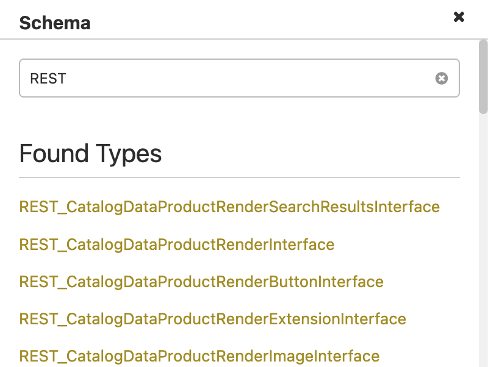

# API Mesh walkthrough

This walkthrough covers the basic actions you can perform in a mesh using API Mesh for Adobe Developer App Builder.

## Prerequisites

- An Adobe IO account to access the [Adobe Developer Console](https://developer.adobe.com/console)
- Install [`Node.js`](https://nodejs.org/en/download/)
  - You can run `node -v` and `npm -v` to determine if `node.js` is successfully installed.
  
  NOTE: Restart your IDE after installing `node`.

- Install a Node Version Manager (`nvm`)
  - (MAC) - [Node Version Manager](https://github.com/nvm-sh/nvm)
  - (Windows) - [nvm-windows](https://github.com/coreybutler/nvm-windows)
- Install the [Adobe `aio` CLI](https://developer.adobe.com/runtime/docs/guides/tools/cli_install/) with the following command:

  ```bash
  npm install -g @adobe/aio-cli
  ```

## Create a project and workspace

1. In the [Adobe Developer Console](https://developer.adobe.com/console), select the desired organization from the dropdown in the top-right corner.

1. Then click [**Create project from template**](https://developer.adobe.com/developer-console/docs/guides/projects/projects-template/).

1. Select **App Builder**.

1. Change the **Project title** to "my_test_workspace".

1. Click Save. You now have a project named "my_test_workspace" with workspaces named "Production" and "Stage".

## Install the API Mesh plugin

Install the [API Mesh plugin](https://www.npmjs.com/package/@adobe/aio-cli-plugin-api-mesh) with the following command:

  ```bash
  npm install -g @adobe/aio-cli-plugin-api-mesh
  ```

## Create a mesh

1. Run the following command to log into Adobe IO:

  ```bash
  aio login
  ```

1. Create a file named `mesh.json` with the following contents:

    ```json
      {
        "meshConfig": {
          "sources": [
            {
              "name": "REST",
              "handler": {
                "openapi": {
                  "source": "https://venia.magento.com/rest/all/schema?services=all"
                }
              }
            },
            {
              "name": "GraphQL",
              "handler": {
                "graphql": {
                  "endpoint": "https://venia.magento.com/graphql"
                }
              }
            }
          ]
        }
      }
    ```

  This mesh configuration files specifies the `sources` where you get data from and the `transforms` that manipulate that data.

1. Run the following command:

    ```bash
    aio api-mesh:create mesh.json
    ```

1. Use the arrow keys to select the `my_test_workspace` Project and click **Enter**. If you want to use this project for future operations, type `y` and press the **Enter** key.

1. Use the arrow keys to select the `stage` Workspace and click **Enter**. If you want to use this workspace for future operations, type `y` and press the **Enter** key.

1. Type `y` and click the **Enter** key to confirm the creation of the mesh. The mesh configuration and corresponding details will display.

1. Run the `aio api-mesh:status` command to view your mesh status. It can take up to five minutes for new meshes to build. After your mesh is built, proceed to the next section.

## Access the Mesh

1. Run the [`aio api-mesh:describe`](command-reference.md#aio-api-meshdescribe) command and copy the URL for your mesh.

1. Paste the URL into a GraphQL client, such as [Altair](https://altairgraphql.dev), [GraphiQL](https://github.com/graphql/graphiql), or [Insomnia](https://insomnia.rest/download).

1. Determine if you can view the schema in the **Docs** section of your GraphQL client. Refer to your GraphQL client's documentation to learn how to access the schema.

    If you can view the schema, proceed to the next section. If you cannot view the schema, go back and check your mesh's sources. You can use the [`aio api-mesh:update`](command-reference.md#aio-api-meshupdate) command to update your mesh with the correct information.

## Run a query

In your GraphQL client, run the following GraphQL query:

```graphql
{
  storeConfig{
    store_code
    store_name
    base_currency_code
  }
  directoryDataCountryInformationInterface(countryId:"US"){
    availableRegions{
      code
      name
      id
    }
  }
}
```

This query demonstrates how you can return data from multiple sources within your mesh with a single query.

The `storeConfig` field returns information from your `GraphQL` handler, while the `directoryDataCountryInformationInterface` field returns information from your `REST`  handler.

## Add a transform

Now we will apply a transform to make the schema more usable by adding a `prefix`. You can also use the `prefix` transform to avoid conflicting field names between sources.

1. Modify your mesh.json file to match the following:

  ```json
  {
    "meshConfig": {
      "sources": [
        {
          "name": "CommerceREST",
          "handler": {
            "openapi": {
              "source": "https://accenturetest.magento.com/rest/all/schema?services=all"
            }
          },
          "transforms": [
            {
              "prefix": {
                "value": "REST_"
              }
            }
          ]
        },
        {
          "name": "CommerceCoreGraph",
          "handler": {
            "graphql": {
              "endpoint": "https://accenturetest.magento.com/graphql"
            }
          },
          "transforms": [
            {
              "prefix": {
                "value": "GraphQL_"
              }
            }
          ]
        }
      ]
    }
  }
  ```

  These `transforms` apply a `prefix` to both sources, which will modify field names in the schema to begin with either `REST_` or `GraphQL_`, depending on which source they are from.

1. Update your mesh by using the following command:

  ```bash
  aio api-mesh:update mesh.json
  ```

1. After you have successfully updated, return to your GraphQL client and open the schema. Search for "GraphQL" or "Rest" to see if the `prefix` transform was successful. It can take up to five minutes for updated meshes to propagate.



## Add a source

You can use the [source commands](command-reference.md#aio-api-meshsourceinstall) to install preconfigured first and third-party sources. You can find available sources by running the `aio api-mesh:source:discover` command or visiting the Adobe [api-mesh-sources](https://github.com/adobe/api-mesh-sources) repo.

1. Run the following source command. The response might ask you to reselect your Workspace and Project.

  ```bash
  aio api-mesh:source:install CommerceCatalogServiceGraph
  ```

1. When you are prompted to enter an API Key, enter a placeholder value like `1234567890` and press the **Enter** key.

1. After you have successfully added the source, run the following command to view your updated mesh configuration.

```bash
aio api-mesh:get
```
