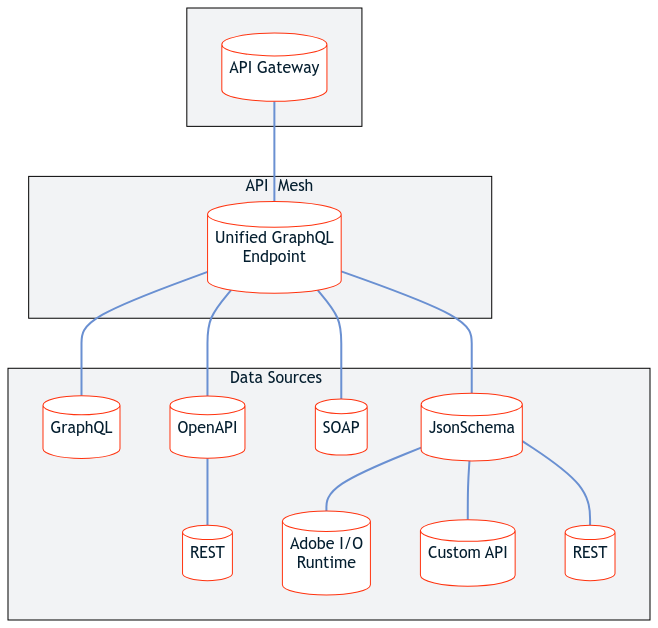

import MigrationNotice from '/src/_includes/migration-notice.md'

<MigrationNotice />

<Hero slots="image, heading, text"/>

# API Mesh for Adobe Developer App Builder

API Mesh for Adobe Developer App Builder is an orchestration layer that enables developers to seamlessly integrate private and third-party APIs with Adobe products and APIs.

API Mesh allows developers to combine multiple data sources into a single, queryable GraphQL endpoint. [GraphQL](https://graphql.org/) allows you to determine the information the response contains, unlike REST APIs, which have fixed response formats.

By serving multiple sources through a single gateway and providing customized responses, API Mesh creates a better user experience for accessing your backend services.

## Features

-  **Adobe API Manager** - A reverse proxy that accepts most API calls for many backend services
-  **Configurable Integrations** - Low/No-code method to integrate with your own private APIs with Adobe Commerce, other Adobe products, and third-party APIs
-  **Backward Compatibility** - Preserve existing APIs while gradually adopting new ones
-  **Extensibility** - Customize and extend your APIs directly in the gateway without making changes to the API source

### Related information

Use the following sections to learn more about the API Mesh and extensibility at Adobe.

<DiscoverBlock slots="link, text"/>

[API Mesh for Adobe Developer App Builder](mesh/index.md)

Allows developers to integrate private and third-party APIs and other software interfaces with Adobe Commerce and other Adobe products using Adobe IO.

<DiscoverBlock slots="link, text"/>

[App Builder](https://developer.adobe.com/app-builder/docs/overview/)

Is a complete framework that enables enterprise developers to build and deploy custom web applications that extend Adobe Experience Cloud solutions and run on Adobe infrastructure.

<DiscoverBlock slots="link, text"/>

[Adobe I/O Events for Adobe Commerce](https://developer.adobe.com/commerce/extensibility/events/)

Makes Commerce transactional data available to App Builder using Adobe I/O. You can define the events to transmit data each time an event triggers, or only under circumstances defined within configuration rules.

## Contributing to this documentation

We encourage you to participate in our open documentation initiative. If you have suggestions, corrections, additions, or deletions for this documentation, check out the source on [GitHub](https://github.com/AdobeDocs/graphql-mesh-gateway) and open a pull request.
