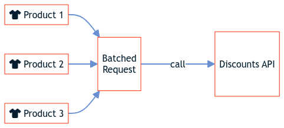

# Batching with API Mesh for Adobe Developer App Builder

Batching allows you to combine a group of requests into a single request, turning multiple queries into a single one. Compared to sending multiple queries simultaneously, batched requests result in better response times. They also avoid issues with rate-limiting.

<InlineAlert variant="info" slots="text"/>

Batching is only possible if the APIs included in your mesh support batching.

The following graphics depict the difference between queries with batched and unbatched calls:

## Unbatched

If your sources do not support batching, each query runs separately.


## Batched

If your sources support batching, and you batch with [declarative](#batching-with-declarative-resolvers) or [programmatic resolvers](#batching-with-programmatic-resolvers), multiple queries combine to form a single request.



## The `n+1` problem

The `n+1` problem occurs when you request multiple pieces of information that cause the system to make multiple (`n`) queries to a source instead of using a single query. Since each query takes approximately the same amount of time, processing many queries can lead to degraded performance. In this example, a Reviews API contains reviews of your products by SKU. Without batching, you would need to query each SKU individually to return the corresponding reviews.

## Example (without batching)

Consider a scenario where you are using the following mesh, where the `Reviews` source is a third-party API that contains reviews for your products by SKU. Each review consists of a `review`, `customer_name`, and `rating` field.

```json
{
  "meshConfig": {
    "sources": [
      {
        "name": "Products",
        "handler": {
          "graphql": {
            "endpoint": "https://venia.magento.com/graphql"
          }
        }
      },
      {
        "name": "Reviews",
        "handler": {
          "graphql": {
            "endpoint": "<Reviews_API_URL>",
            "useGETForQueries": true
          }
        }
      }
    ],
    "additionalTypeDefs": "extend type ConfigurableProduct { customer_reviews: [productReviewslist]} ",
    "additionalResolvers": [
      {
        "targetFieldName": "customer_reviews",
        "targetTypeName": "ConfigurableProduct",
        "sourceName": "Reviews",
        "sourceTypeName": "Query",
        "sourceFieldName": "productsReviews",
        "requiredSelectionSet": "{ sku }",
        "sourceArgs": {
          "sku": "{root.sku}"
        }
      }
    ],
    "responseConfig": {
      "includeHTTPDetails": true
    }
  }
}
```

<InlineAlert variant="info" slots="text"/>

Use `"includeHTTPDetails": true` to see response details that indicate how many calls your mesh made to each source.

The [custom resolver](../extend/index.md) extends the type `ConfigurableProduct` with a new `customer_reviews` field, which allows nesting review fields inside of queries against the Venia source. The resolver is composed of the following components:

- The target (`targetTypeName`, `targetFieldName`) - describes the queried field.
- The source (`sourceName`, `sourceTypeName`, `sourceFieldName`) - describes where the data is resolved for the target field.
- `requiredSelectionSet` fetches the required arguments.
- `sourceArgs` maps the `requiredSelectionSet` argument to the source.


<InlineAlert variant="info" slots="text"/>

Use `"includeHTTPDetails": true` to see response details that indicate how many calls your mesh made to each source.

The following query causes multiple calls to the Reviews API:

```graphql
{
  products(filter: { sku: { in: ["VD03", "VT12"] } }) {
    items {
      ... on ConfigurableProduct {
        sku
        name
        customer_reviews {
          sku
          reviews {
            review
            customer_name
            rating
          }
        }
        __typename
      }
    }
  }
}
```

## Batching with declarative resolvers

The following example explains how to use batching inside your mesh configuration file by using [declarative resolvers](./resolvers/index.md).

The `Reviews` source takes an array of product SKUs and returns an array of reviews for each SKU. To make a single network request to the `Reviews` source for multiple SKUs, add `keysArg` and `keyField` to your mesh.

<InlineAlert variant="info" slots="text"/>

Request batching using API Mesh requires a source endpoint capable of processing an array of values.

```json
{
  "meshConfig": {
    "sources": [
      {
        "name": "Products",
        "handler": {
          "graphql": {
            "endpoint": " https://venia.magento.com/graphql"
          }
        }
      },
      {
        "name": "Reviews",
        "handler": {
          "graphql": {
            "endpoint": "<Reviews_API_URL>",
            "useGETForQueries": true
          }
        }
      }
    ],
    "additionalTypeDefs": "extend type ConfigurableProduct { customer_reviews: productReviewslist} ",
    "additionalResolvers": [
      {
        "targetFieldName": "customer_reviews",
        "targetTypeName": "ConfigurableProduct",
        "sourceName": "Reviews",
        "sourceTypeName": "Query",
        "sourceFieldName": "productsReviews",
        "keysArg": "sku",
        "keyField": "sku"
      }
    ],
    "responseConfig": {
      "includeHTTPDetails": true
    }
  }
}
```

`requiredSelectionSet` and `sourceArgs` are replaced with `keysarg` and `keyField`:

- `keysArg` provides the name of the primary key argument. For this example, the `keysArg` field is the argument name used when sending an array of SKUs to fetch multiple reviews.

- `keyField` provides the key value for each item in the batched query. For this example, the `keyField` indicates which Product field provides the SKU value to the review service.

With the updated mesh, using the [previous query](#example-without-batching) returns the same information, but only makes one call to the `Reviews` source for multiple SKUs.

## Batching with programmatic resolvers

The following example explains how to use batching inside your mesh configuration file by using [programmatic resolvers](./resolvers/programmatic-resolvers.md).

In the following example, `args.skus` creates an array of SKUs to query instead of querying each SKU individually. The `valuesFromResults` object is optional and allows you to filter, sort, and transform your results.

In the following example, you would create your mesh configuration file (`mesh.json`) and the referenced JavaScript file (`resolver.js`) in the same directory.

<InlineAlert variant="info" slots="text"/>

The `resolvers.js` file contains similar logic to the `additionalResolvers.js` file in [Programmatic Resolvers](./resolvers/programmatic-resolvers.md#additional-resolversjs), but adds batching and logging.

<CodeBlock slots="heading, code" repeat="3" languages="json, javascript, graphql" />

#### `mesh.json`

```json
{
  "meshConfig": {
    "sources": [
      {
        "name": "Commerce",
        "handler": {
          "graphql": {
            "endpoint": "https://venia.magento.com/graphql"
          }
        }
      },
      {
        "name": "DiscountsAPI",
        "handler": {
          "JsonSchema": {
            "baseUrl": "https://raw.githubusercontent.com/AdobeDocs/graphql-mesh-gateway/main/src/pages/_examples/discounts-api.json",
            "operations": [
              {
                "type": "Query",
                "field": "discounts",
                "path": "/getDiscounts?skus={args.skus}",
                "method": "GET",
                "responseSample": "https://raw.githubusercontent.com/AdobeDocs/graphql-mesh-gateway/main/src/pages/_examples/random-discount.json",
                "argTypeMap": {
                  "skus": {
                    "type": "array"
                  }
                }
              }
            ]
          }
        }
      }
    ],
    "additionalResolvers": [
      "./resolver.js"
    ]
  }
}
```

#### `resolver.js`

```javascript
module.exports = {
  resolvers: {
    ConfigurableProduct: {
      special_price: {
        selectionSet: "{ name price_range { maximum_price { final_price { value } } } }",
        resolve: (root, args, context, info) => {
          return context.DiscountsAPI.Query.discounts({
              root,
              key: root.sku,
              argsFromKeys: (skus) => ({
                skus
              }),
              valuesFromResults: (results) =>
                results.map(({
                  discount
                }) => discount),
              context,
              info,
              selectionSet: "{ sku discount }",
            })
            .then((discount) => {
              let max = 0;

              try {
                max = root.price_range.maximum_price.final_price.value;
              } catch (e) {
                max = 0;
              }

              if (discount) {
                return max * ((100 - discount) / 100);
              } else {
                return max;
              }
            })
            .catch((e) => {
              context.logger.error(e);
              return null;
            });
        },
      },
    },
  },
};
```

#### Sample query

```graphql
{
  products(filter: { sku: { in: ["VD03", "VT12"] } }) {
    items {
      ... on ConfigurableProduct {
        sku
        name
        customer_reviews {
          sku
          reviews {
            review
            customer_name
            rating
          }
        }
        __typename
      }
    }
  }
}
```
