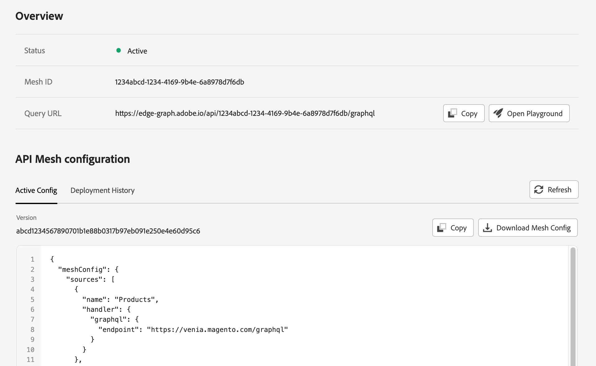

# Create a mesh

This page provides the basic steps for creating your first mesh.

## Requirements

Before creating a mesh, create a project or a templated project and workspace for the mesh. For other requirements see [Prerequisites](./index.md#prerequisites).

### Create a project

When you [create a mesh](../basic/create-mesh.md), you must assign the mesh to a specific project. To create a new project, log in to the [Adobe Developer Console](https://developer.adobe.com/console) and [create a project](https://developer.adobe.com/developer-console/docs/guides/projects/#create-a-new-project).

### Add a workspace to your project

If you are [creating a templated project](https://developer.adobe.com/developer-console/docs/guides/projects/projects-template/), you can add [workspaces](https://developer.adobe.com/developer-console/docs/guides/projects/projects-template/#workspaces). Workspaces allow you to create separate environments. You can also create workspaces for each developer on your team.

Workspaces that already have an API mesh will have "API Mesh" displayed on their workspace card in the developer console. To learn more about viewing, deleting, or selecting projects and workspaces, see [Projects and workspaces](work-with-mesh.md#projects-and-workspaces).


## Create a mesh

When you create or update a mesh configuration, API Mesh requires some processing time before your mesh is available. If you intend to perform several create or update commands, consider using our [local development](../advanced/developer-tools.md#create-a-local-environment) feature to test your mesh configuration locally.

Refer to the [command reference](../advanced/index.md#aio-api-meshcreate) for a detailed description of `aio api-mesh:create`.

<InlineAlert variant="info" slots="text"/>

When creating or updating a mesh, the file to upload must have the `.json` filename extension.

1. Create and save a JSON configuration file that defines the properties of your mesh. Your mesh is defined by a combination of [handlers](./handlers/index.md) and [transforms](./transforms/index.md). In this example, the filename is `mesh.json`.

  The following mesh file can be used with minimal setup to access the endpoint of the [Venia](https://developer.adobe.com/commerce/pwa-studio/guides/packages/venia/) demo store.

  ``` json
  {
  "meshConfig": {
      "sources": [
        {
          "name": "Commerce",
          "handler": {
            "graphql": {
              "endpoint": "https://venia.magento.com/graphql/"
            }
          }
        }
      ]
    }
  }
  ```

1. Run the login command and provide your credentials in the browser window.

    ```bash
    aio auth:login
    ```

1. Run the following command to create a mesh. In this example, the filename is `mesh.json`.

    ```bash
    aio api-mesh:create mesh.json
    ```

1. If you have not already [selected a project and workspace manually](work-with-mesh.md#select-a-project-or-workspace), choose the organization, project, and workspace that you want to create the mesh in. If you do not have a project, see [Create a project](#create-a-project).

  You must also indicate if you want to automatically select the specified organization and workspace in the future. If you answer **Yes** to either of these prompts and you want to select an organization or workspace other than the cached organization and workspace. You can use the `-i` or `-ignoreCache` flag to clear the cache, allowing you to select another organization and workspace. You can also manually [modify the selected project or workspace](work-with-mesh.md#projects-and-workspaces).

  **Note:** Each workspace within a project can only have one mesh associated with it at a time.

1. When you are prompted to confirm that you want to create a mesh, select **Yes**. If you want to automatically confirm the creation, add the `-c` or `--autoConfirmAction` flag to your create command.

### Access your mesh URLs

<InlineAlert variant="info" slots="text"/>

If you have an allowlist, consider adding the [edge mesh IP addresses](https://www.cloudflare.com/ips/).

The `aio api-mesh:create` response assigns you a `meshId`. Use the [`aio api-mesh:status`](../advanced/index.md#aio-api-meshstatus) command to see the status of your mesh creation. You can run the [`aio api-mesh:describe`](../advanced/index.md#aio-api-meshdescribe) command to get your `apiKey` and a GraphQL endpoint that you can use to query your mesh.

After successfully running the status command, the response provides both legacy and edge URLs:

  ```terminal
  Legacy Mesh Status: 
  Your mesh was successfully built.
  *********************************
  Edge Mesh Status:
  Your mesh was successfully built.
  ```

Until Adobe migrates all legacy mesh URLs, the response to the `aio api-mesh:describe` command will list both the legacy and edge mesh URLs. The legacy mesh URL is a standard mesh URL, which Adobe will migrate soon. See the [migration notice](../release/migration.md) for more information.

The edge mesh URL offers several benefits because the edge is closer to your data sources. Edge meshes can provide the following advantages:

- Improved response times and enhanced API performance
- Easier integration with industry-standard tools and third-party products
- Enhanced performance reliability through inherent tenant isolation
- Better security and compliance
- Increased observability

<InlineAlert variant="warning" slots="text"/>

Edge meshes do not currently support Hooks or SOAP handlers. If you need to use these features, you must use a legacy mesh. These features will be available in edge meshes in the future.

<InlineAlert variant="info" slots="text"/>

Legacy mesh URLs will be deprecated in the future. Use the edge mesh URLs whenever possible.

## Optimizing edge mesh performance

Edge meshes are resilient and performant because they exist closer to where the query originates, in over 330 locations in 120 countries. This means that your queries can hit a server that has not cached your mesh, causing a cold start.

If you are using an API platform or a GraphQL client, add the [`Connection: Keep-Alive`](https://developer.mozilla.org/en-US/docs/Web/HTTP/Headers/Keep-Alive) header to your requests. This header keeps the connection to the server open for future requests, which can significantly improve performance because it ensures you are hitting a warm cache. Using this header also prevents the unnecessary repetition of several steps of the [HTTP handshake](https://developer.mozilla.org/en-US/docs/Web/HTTP/Connection_management_in_HTTP_1.x).

<InlineAlert variant="info" slots="text"/>

Some platforms and command-line tools, such as cURL, do not respect the `Connection: Keep-Alive` header. Consider [priming your mesh](../best-practices/performance.md) to improve performance.

## Create a mesh from a source

The `aio api-mesh:source` commands provide several prebuilt mesh sources that you can use to create your mesh file, for example `mesh.json`. Each source contains a mesh configuration file designed for a specific first or third-party source. Third parties can submit their sources as a pull request to the [api-mesh-sources](https://github.com/adobe/api-mesh-sources) repository. Once approved, these sources will be available for selection in the CLI.

Currently, this feature serves as a way for you to quickly copy an example mesh.

1. To choose a prebuilt source from a list, run the following command:

  ```bash
  aio api-mesh:source:discover
  ```

  **Note**: Alternatively, you can use the [aio api-mesh:source:install](../advanced/index.md#aio-api-meshsourceinstall) command if you know the source you want to install.

1. Use the arrow keys to select which source you want to copy and press Enter. You can use the Spacebar to select multiple sources.

1. Confirm that you want to print the configuration in the console. The mesh configuration prints in your terminal and is automatically copied to your clipboard depending on your selections.

1. Review the mesh configuration. When you are ready to install the mesh configuration, run the `aio api-mesh:source:install` command followed by the `"<source_name>"` you want to install, for example:

```bash
aio api-mesh:source:install "AEM Assets API"
```

  You can repeat this process multiple times to add sources to your mesh.

<InlineAlert variant="info" slots="text"/>

Alternatively, you can use the [aio api-mesh:source:get](../advanced/index.md#aio-api-meshsourceget) command to print the source in the terminal or copy the source to the clipboard.

Refer to the [Command reference](../advanced/index.md#aio-api-meshsourceinstall) flags to learn how to replace variables in the source mesh configuration.

## Create a mesh from a template

You can also create a mesh automatically when [bootstrapping a new app through the CLI](https://developer.adobe.com/app-builder/docs/getting_started/first_app/#4-bootstrapping-new-app-using-the-cli):

1. Navigate to the location you want to initialize your project and enter the following command:

    ```bash
    aio app init
    ```

1. Select the desired organization, project, and workspace by using the arrow keys, or start typing to search.

1. Select the `generator-app-api-mesh` standalone application.

1. Indicate if you want this app to be a single-page application accessible through the Experience Cloud UI.

1. Indicate if you want to create a sample mesh.

1. After the process completes, you are provided a link to your [API mesh endpoint](#access-the-gateway).

1. When you are ready, you can deploy your app by running the following command:

    ```bash
    aio app deploy
    ```

1. After the process completes, you are provided a link to your app at `experience.adobe.com`.

## Mesh example

The following example adds both an Adobe Commerce instance (with Catalog Service enabled) and an Adobe Experience Manager instance to the mesh. The GraphQL endpoints for Commerce and Catalog Service are different, so you must configure them separately.

```json
{
  "meshConfig": {
    "sources": [
      {
        "name": "Commerce",
        "handler": {
          "graphql": {
            "endpoint": "https://<your_commerce_site>/graphql/"
          }
        }
      },
      {
        "name": "AEM",
        "handler": {
          "graphql": {
            "endpoint": "https://<your_AEM_site>/endpoint.json"
          }
        }
      },
      {
        "name": "CatalogService",
        "handler": {
          "graphql": {
            "endpoint": "https://catalog-service.adobe.io/graphql/",
            "operationHeaders": {
              "x-api-key": "<api_key>",
              "Magento-Environment-Id": "<your_environment_id>",
              "Magento-Website-Code": "base",
              "Magento-Customer-Group": "<customer_group_value>",
              "Magento-Store-Code": "main_website_store",
              "Magento-Store-View-Code": "default"
            },
            "schemaHeaders": {
              "x-api-key": "<api_key>"
            }
          }
        },
        "transforms": [
          {
            "prefix": {
              "includeRootOperations": true,
              "includeTypes": false,
              "value": "catalog_"
            }
          }
        ]
      }
    ]
  }
}
```

<InlineAlert variant="info" slots="text"/>

The previous example mesh includes a [`prefix` transform](./transforms/prefix.md) for the `CatalogService` source to prevent schema conflicts. This transform adds the `catalog_` prefix to all root operations in the source.

## Update an existing mesh

If you make any changes to your mesh file, such as adding [transforms](./transforms/index.md), you must publish them before the changes will be reflected in your gateway. Additionally, if a source schema is modified, you must update your mesh to allow API Mesh to cache any changes.

The following command updates the mesh in the selected workspace with the settings specified in the `update-mesh.json` file.

```bash
aio api-mesh:update update-mesh.json
```

```json
    {
      "meshConfig": {
        "sources": [
          {
            "name": "Commerce",
            "handler": {
              "graphql": {
                "endpoint": "https://<your_commerce_site>/graphql/"
              }
            }
          },
          {
            "name": "AEM",
            "handler": {
              "graphql": {
                "endpoint": "https://<your_AEM_site>/endpoint.json"
              }
            }
          },
          {
            "name": "CatalogService",
              "handler": {
                "graphql": {
                  "endpoint": "https://catalog-service.adobe.io/graphql/search/graphql",
                  "operationHeaders": {
                    "x-api-key": "<api_key>",
                    "Magento-Environment-Id": "<your_environment_id>",
                    "Magento-Website-Code": "base",
                    "Magento-Customer-Group": "<customer_group_value>",
                    "Magento-Store-Code": "main_website_store",
                    "Magento-Store-View-Code": "default"
                  },
                  "schemaHeaders": {
                    "x-api-key": "<api_key>"
                  }
                }
              }
            }
          ]
        }
    }
```

## View your mesh in the Adobe Developer Console

As an alternative to running the [`aio api-mesh:get`](../advanced/index.md#aio-api-meshget) command, you can view your mesh details by selecting the **API Mesh** section in the desired workspace in the [Adobe Developer Console](https://developer.adobe.com/console).

On the API Mesh Details screen, you can use the tabs to view different segments of your mesh.



To download a copy of your mesh file, click the **Download Mesh Schema** button at the top of the API Mesh Details screen.


