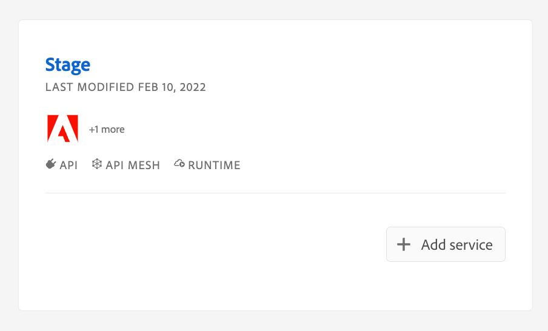

# CI/CD for API Mesh

API Mesh for Adobe Developer App Builder now provides CI/CD through [Github actions](https://docs.github.com/en/actions). CI/CD ensures rapid, reliable software delivery, which fosters agility and quality throughout the development lifecycle.

<InlineAlert variant="info" slots="text"/>

API Mesh and App Builder use the same tools and infrastructure to provide CI/CD. See [CI/CD in App Builder](https://developer.adobe.com/app-builder/docs/resources/ci-cd/) for more information.

## 1. Add Authentication to your workspace

This step adds the I/O Management API to your workspace. Proceed to the next step if it is already installed.

<InlineAlert variant="info" slots="text"/>

[Create your mesh](../basic/create-mesh.md) before beginning this process, the supplied GitHub action only handles mesh updates.

To get an OAuth token to enable CI/CD:

1. Navigate to the [Adobe Developer Console](https://developer.adobe.com/console) and select the workspace that contains your mesh.

    

1. Click the **Add Service** button and select API.

1. From the list of APIs, select the **I/O Management API** under the Adobe Services filter and click **Next**.

    

1. With OAuth Server-to-Server selected, click **Save configured API**.

1. Click **OAuth Server-to-Server** inside the I/O Management API.

## 2. Set up your API Mesh repository

A GitHub repository is necessary for hosting your mesh files. If you use another `git` development platform, see [using your own CI/CD](#bring-your-own-cicd).

After [creating a local environment](../advanced/developer-tools.md#create-a-local-environment) by running the `aio api-mesh:init` command, upload your local files to [GitHub](https://docs.github.com/en/repositories/creating-and-managing-repositories/quickstart-for-repositories).

<InlineAlert variant="info" slots="text"/>

When running the `aio api-mesh:init` command, ensure that you enable `git` by following the command prompts.

Once your repository is accessible, clone your repo locally using the following command:

```bash
git clone https://github.com/<org>/<project_name>.git
```

You will continue to use this repo to make changes to your mesh.

## 3. Configure your secrets and variables

When developing locally, you can store your variables and secrets in your [environment variables file](../advanced/developer-tools.md#environment-variables). When using GitHub, you will need to use [secrets](https://docs.github.com/en/actions/security-guides/using-secrets-in-github-actions) and [variables](https://docs.github.com/en/actions/learn-github-actions/variables).

- Variables are for information that is not sensitive, for example, a variable could determine if you are targeting `stage` or `prod`. Additionally, you can configure variables to carry different values based on the environment you are using.

- Secrets are for sensitive information, such as access tokens. These are never exposed in the Github code repo.

### Add a secret or variable

<InlineAlert variant="info" slots="text"/>

To add secrets or variables, you must have administrative permissions in the target GitHub repository.

1. Navigate to `https://github.com/<org>/<project_name>/settings/secrets/actions`.

1. On the **Secrets** or **Variables** tab, click either **New repository secret** or **New repository variable**.

1. Enter a name for the secret or variable, such as `CLIENTID_PROD`.

1. Enter the corresponding value for the secret or variable, for example, `123456123456`.

The next section, [Create an action](#4-create-a-github-action), describes a `yml` file that requires the following secrets/variables:

```yml
CLIENTID: ${{ secrets.CLIENTID_PROD }}
CLIENTSECRET: ${{ secrets.CLIENTSECRET_PROD }}
TECHNICALACCOUNTID: ${{ secrets.TECHNICALACCID_PROD }}
TECHNICALACCOUNTEMAIL: ${{ secrets.TECHNICALACCEMAIL_PROD }}
IMSORGID: ${{ secrets.IMSORGID_PROD }}
ORGID: ${{ secrets.ORGID_PROD }}
PROJECTID: ${{ secrets.PROJECTID_PROD }}
WORKSPACEID: ${{ secrets.WORKSPACEID_PROD }}
```

For example, if you named a secret `CLIENTID_PROD`, you can call that secret using the `${{ secrets.CLIENTID_PROD }}` format.

The specific secrets required for this workflow are available in the [Developer Console](https://developer.adobe.com/console) by navigating to the desired workspace within a project and clicking the **Download all** button in the top-right of the screen. This downloads a `JSON` file.

The following table lists the variable name and its corresponding location in the downloaded `JSON` file:

| Variable name in Github | Name defined in downloaded JSON |
| ---------- | ------- |
| CLIENTID | `client_id` |
| CLIENTSECRET | `client_secret` |
| TECHNICALACCOUNTID | `technical_account_email` |
| TECHNICALACCOUNTEMAIL | `technical_account_id` |
| IMSORGID | `ims_org_id` |
| ORGID | `project` > `org` > `id` |
| PROJECTID | `project` > `id` |
| WORKSPACEID | `project` > `workspace` > `id` |

Create a GitHub secret for each of these items.

You also need to specify the `id` for the organization, project, and workspace in the following section of GitHub workflow. These values are also available in the file downloaded from the Developer Console:

```yml
- name: Select org
  run: aio console:org:select ${{ secrets.ORGID_PROD }}
- name: Select project
  run: aio console:project:select ${{ secrets.PROJECTID_PROD }}
- name: Select workspace
  run: aio console:workspace:select ${{ secrets.WORKSPACEID_PROD }}
```

Repeat this process in your local environment, by adding these values as [environment variables](../advanced/developer-tools.md#environment-variables).

This CI/CD process corresponds to a single workspace. If you want to create another workflow, for example, to differentiate between `stage` and `prod`, you need to:

-  Duplicate the workflow you created
-  Replace the workspace `id`

## 4. Create a GitHub action

The GitHub action described in this section updates the specified mesh when a PR is merged to the `main` branch of your repository. This step uses the variables and secrets you configured in the previous section.

This workflow relies on two existing Adobe I/O GitHub Actions published on the GitHub Marketplace:

-  [`adobe/aio-cli-setup-action`](https://github.com/adobe/aio-cli-setup-action) installs and configures the [CLI](https://github.com/adobe/aio-cli) on the GitHub infrastructure. For API Mesh, this action handles authentication.

- [`adobe/aio-apps-action`](https://github.com/adobe/aio-apps-action) centralizes support for a GitHub workflow to leverage application-specific commands, such as deploying via `aio api-mesh:update`.

In the `.github/workflows` folder, create a `.yml` file with the following contents:

```yml
name: CI

# Controls when the workflow will run
on:
  # Triggers the workflow on push or pull request events but only for the "main" branch
  # push:
  #   branches: [ "main" ]
  # pull_request:
  #   branches: [ "main" ]

  # Allows you to run this workflow manually from the Actions tab
  workflow_dispatch:

# A workflow run is made up of one or more jobs that can run sequentially or in parallel
jobs:
  # This workflow contains a single job called "build"
   deploy:
    name: Deploy to Prod
    runs-on: ${{ matrix.os }}
    strategy:
      max-parallel: 1
      matrix:
        node-version: ['20']
        os: [ubuntu-latest]
    steps:
      - name: Checkout
        uses: actions/checkout@v4
      - name: Use Node.js ${{ matrix.node-version }}
        uses: actions/setup-node@v4
        with:
          node-version: ${{ matrix.node-version }}
      - name: Setup CLI
        uses: adobe/aio-cli-setup-action@1.3.0
        with:
          os: ${{ matrix.os }}
          version: 10.x.x
      - name: api-mesh-plugin install
        run: aio plugins:install @adobe/aio-cli-plugin-api-mesh
      - name: Auth
        uses: adobe/aio-apps-action@3.3.0
        with:
          os: ${{ matrix.os }}
          command: oauth_sts
          CLIENTID: ${{ secrets.CLIENTID_PROD }}
          CLIENTSECRET: ${{ secrets.CLIENTSECRET_PROD }}
          TECHNICALACCOUNTID: ${{ secrets.TECHNICALACCID_PROD }}
          TECHNICALACCOUNTEMAIL: ${{ secrets.TECHNICALACCEMAIL_PROD }}
          IMSORGID: ${{ secrets.IMSORGID_PROD }}
          SCOPES: AdobeID, openid, read_organizations, additional_info.projectedProductContext, additional_info.roles, adobeio_api, read_client_secret, manage_client_secrets
      - name: Select org
        run: aio console:org:select ${{ secrets.ORGID_PROD }}
      - name: Select project
        run: aio console:project:select ${{ secrets.PROJECTID_PROD }}
      - name: Select workspace
        run: aio console:workspace:select ${{ secrets.WORKSPACEID_PROD }}
      - name: api-mesh update
        run: aio api-mesh:update -c meshConfig.json --env .env 
```

This script sets up the CLI, installs the API Mesh plugin (`aio-cli-plugin-api-mesh`), and adds your OAuth token. Once the workflow is configured, running its corresponding job on the GitHub **Actions** tab will update your mesh.

Uncomment the following section to automatically trigger this workflow when a PR is merged `main`:

```yml
push:
  branches: [ "main" ]
```

Uncomment the following section to automatically trigger this workflow when a PR to `main` is updated:

```yml
pull_request:
  branches: [ "main" ]
```

For more information see [Events that trigger workflows](https://docs.github.com/en/actions/using-workflows/events-that-trigger-workflows).

## Bring your own CI/CD

Although GitHub is the recommended CI/CD platform, you can use other CI/CD platforms. Refer to the alternative CI/CD platform's documentation for secrets management and workflow creation, because the syntax of the workflow and variables will be different for each platform.

When using your own CI/CD platform, there are two important considerations:

- The [Adobe I/O CLI](https://github.com/adobe/aio-cli) is the official tool for managing the App Builder Application development lifecycle from bootstrapping to deployment. Use the CLI within a CI/CD workflow for automation purposes.

- Security is a key requirement. Any alternative CI/CD workflows should provide a secret management solution to store the credentials required to deploy an App Builder Application against a specific Workspace. You can set these tokens in an `.aio` file or by using system or environment variables.

The [`aio-apps-action`](https://github.com/adobe/aio-apps-action) can be used as a reference for constructing your own pipeline. This CI/CD Github action for automated deploys generates a token for the CLI to avoid login. The Adobe Developer Console documentation provides more information on [generating access tokens programmatically](https://developer.adobe.com/developer-console/docs/guides/authentication/ServerToServerAuthentication/implementation/#generating-access-tokens-programmatically).

This [App Builder Live demo](https://www.youtube.com/live/lbB2jl2rQZM?feature=share&t=1815) provides a walkthrough of how you might create your own CI/CD pipeline.
