# Combining Multiple Sources

This document refers to the "Books", "Authors" and "Stores" example API, available in a dedicated repository: [`graphql-mesh-docs-first-gateway`](https://github.com/charlypoly/graphql-mesh-docs-first-gateway):

- Books API (REST API)
  - `GET /books`
  - `GET /books/:id`
  - `GET /categories`
- Authors API (gRPC API)
  - `GetAuthor`
  - `ListAuthors`
- Stores (GraphQL API)
  - `stores` Query
  - `bookSells(storeId: ID!)` Query

This guide will show how to add 2 new sources (Authors and Stores) to achieve the following Gateway setup:



In addition to adding new sources, we can shape the Unified Schema to accept the following query:

```graphql
query bestSellersByStore {
  stores {
    id
    name
    bookSells {
      sellsCount
      book {
        id
        title
        author {
          id
          name
        }
      }
    }
  }
}
```

## 1. Add the "Authors" Source

<InlineAlert variant="info" slots="text"/>

API Mesh for Adobe Developer App Builder does not currently support the `gRPC` handler.

The "Authors" Source is a gRPC API: [`authors-service`](https://github.com/charlypoly/graphql-mesh-docs-first-gateway/tree/master/packages/authors-service).

We will use the `grpc` Handler with the `@graphql-mesh/grpc` package and configure it in our [`mesh`](https://github.com/charlypoly/graphql-mesh-docs-first-gateway/tree/master/packages/multiple-sources/.meshrc.yaml) file:

```json
{
    "sources": [
        {
            "name": "Books",
            "handler": {
                "openapi": {
                    "baseUrl": "<your_url>",
                    "source": "../books-service/openapi3-definition.json"
                }
            }
        },
        {
            "name": "Authors",
            "handler": {
                "grpc": {
                    "endpoint": "<your_url>",
                    "protoFilePath": "../authors-service/proto/authors/v1/authors_service.proto"
                }
            }
        }
    ]
}
```

Similar to the "Books" API configuration, we just need to provide the path to the service definition file (here, a Proto file) and the base URL.

We will "clean" the corresponding "Authors" GraphQL Schema later, in the 3rd step, [Shaping the Unified Schema](#3-shaping-the-unified-schema).

## 2. Add the "Stores" Source

The "Stores" Source is a GraphQL API: [`stores-service`](https://github.com/charlypoly/graphql-mesh-docs-first-gateway/tree/master/packages/stores-service).

We will use the `graphql` Handler with the `@graphql-mesh/graphql` package and configure it in our [`mesh`](https://github.com/charlypoly/graphql-mesh-docs-first-gateway/tree/master/packages/multiple-sources/.meshrc.yaml) file:

```json
{
    "sources": [
        {
            "name": "Books",
            "handler": {
                "openapi": {
                    "baseUrl": "<your_url>",
                    "source": "../books-service/openapi3-definition.json"
                }
            }
        },
        {
            "name": "Authors",
            "handler": {
                "grpc": {
                    "endpoint": "<your_url>",
                    "protoFilePath": "../authors-service/proto/authors/v1/authors_service.proto"
                }
            }
        },
        {
            "name": "Stores",
            "handler": {
                "graphql": {
                    "endpoint": "https://my-service-url/graphql"
                }
            }
        }
    ]
}
```

Since `Stores` is a GraphQL API, Mesh can leverage introspection to get its schema with just the `endpoint` URL.

## 3. Shaping the Unified Schema

The following Mesh Gateway configuration:

```json
{
    "sources": [
        {
            "name": "Books",
            "handler": {
                "openapi": {
                    "baseUrl": "<your_url>",
                    "source": "../books-service/openapi3-definition.json"
                }
            }
        },
        {
            "name": "Authors",
            "handler": {
                "grpc": {
                    "endpoint": "<your_url>",
                    "protoFilePath": "../authors-service/proto/authors/v1/authors_service.proto"
                }
            }
        },
        {
            "name": "Stores",
            "handler": {
                "graphql": {
                    "endpoint": "https://my-service-url/graphql"
                }
            }
        }
    ]
}
```

Will give us a "raw" GraphQL schema design that contains unwanted GraphQL Queries, badly named types, and a lack of hierarchy:

```graphql
type Query {
  book(id: String!): Book

  books(
    limit: Int
  ): [Book]

  categories(
    limit: Int
  ): [Category]
  authors_v1_AuthorsService_GetAuthor(input: authors_v1_GetAuthorRequest_Input): authors_v1_Author
  authors_v1_AuthorsService_ListAuthors(input: authors_v1_ListAuthorsRequest_Input): authors_v1_ListAuthorsResponse
  authors_v1_AuthorsService_connectivityState(tryToConnect: Boolean): ConnectivityState
  stores: [Store!]!
  bookSells(storeId: ID!): [Sells!]!
}
# ...
```

To achieve a clean Unified Schema design that would allow the following Query:

```graphql
query bestSellersByStore {
  stores {
    id
    name
    bookSells {
      sellsCount
      book {
        id
        title
        author {
          id
          name
        }
      }
    }
  }
}
```

We will need to configure multiple transforms:

- Rename the "Authors" queries
- Remove the unnecessary root queries: `author`, `book`, `categories`, `bookSells`
- Setup some hierarchy between the queries

### Remove unnecessary Root queries

To build a clean Unified Schema, we need to remove unnecessary Queries such as:

- `Query.authors_v1_AuthorsService_GetAuthor` and `Query.authors_v1_AuthorsService_ListAuthors` from the "Authors" Source
- the `Query.!authors_v1_AuthorsService_connectivityState` is automatically generated by the `grpc` handler of the "Authors" Source
- `Query.book` from the "Books" Source
- `Query.bookSells` from the "Stores" Source

Our updated [`mesh`](https://github.com/charlypoly/graphql-mesh-docs-first-gateway/tree/master/packages/multiple-sources/.meshrc.yaml) is the following:

```json
{
    "sources": [
        {
            "name": "Books",
            "handler": {
                "openapi": {
                    "baseUrl": "<your_url>",
                    "source": "../books-service/openapi3-definition.json"
                }
            }
        },
        {
            "name": "Authors",
            "handler": {
                "grpc": {
                    "endpoint": "<your_url>",
                    "protoFilePath": "../authors-service/proto/authors/v1/authors_service.proto"
                }
            }
        },
        {
            "name": "Stores",
            "handler": {
                "graphql": {
                    "endpoint": "https://my-service-url/graphql"
                }
            }
        }
    ],
    "transforms": [
        {
            "filterSchema": {
                "filters": [
                    "Query.!authors_v1_AuthorsService_connectivityState",
                    "Query.!{authors_v1_AuthorsService_GetAuthor, book, bookSells, categories}"
                ]
            }
        }
    ]
}
```

`filterSchema` takes a `filters` option that accepts an array of filter rules.

By adding `Query.!authors_v1_AuthorsService_connectivityState`, we instruct Mesh to remove the `authors_v1_AuthorsService_connectivityState(...)` Query.

Notice that the [`filterSchema`](transforms/filter-schema.md) allows using a bash-like syntax to avoid repetitive configuration with the `{..., ...}` syntax.

Alternatively, you could instruct Mesh to only keep the `Query.stores` root query as follows:

```json
{
    "sources": null,
    "transforms": [
        {
            "filterSchema": {
                "filters": [
                    "Query.stores"
                ]
            }
        }
    ]
}
```

### Setup hierarchy with nested queries

To support the following Query:

```graphql
query bestSellersByStore {
  stores {
    id
    name
    bookSells {
      sellsCount
      book {
        id
        title
        author {
          id
          name
        }
      }
    }
  }
}
```

We need to update the schema to add the following fields:

- `Store.bookSells: [Sells!]!`: to get the selling from a given store
- `Sells.book: Book`: to get the book of a given store selling record
- `Book.author: authors_v1_Author`: to get the author of a book

To achieve this, we will use the `additionalResolvers` and `additionalTypeDefs` configuration from Mesh's `mesh.json` API.

#### Update our Schema with new fields

The `additionalTypeDefs` configuration parameter allows you to merge GraphQL with the Unified Schema definition and [extend existing types](https://spec.graphql.org/June2018/#sec-Object-Extensions) and queries.

If we want to add the `Book.author` field, we first need to know what is the type of Author.

Since the handlers generate most types, it might be hard to guess their correct spelling (e.g. `authors_v1_Author`). A quick way to build an `additionalTypeDefs` is to refer to the generated GraphQL Schema file of each Source that can be found in the [`.mesh/sources`](https://github.com/charlypoly/graphql-mesh-docs-first-gateway/tree/master/packages/multiple-sources/.mesh/sources/) directory.

For example, the GraphQL Schema of the "Authors" Source can be found at [`.mesh/sources/Authors/schema.graphql`](https://github.com/charlypoly/graphql-mesh-docs-first-gateway/tree/master/packages/multiple-sources/.mesh/sources/Authors/schema.graphql):

```graphql
schema {
  query: Query
}

type Query {
  authors_v1_AuthorsService_GetAuthor(input: authors_v1_GetAuthorRequest_Input): authors_v1_Author
  authors_v1_AuthorsService_ListAuthors(input: authors_v1_ListAuthorsRequest_Input): authors_v1_ListAuthorsResponse
  authors_v1_AuthorsService_connectivityState(tryToConnect: Boolean): ConnectivityState
}

type authors_v1_Author {
  id: String
  name: String
  editor: String
}

input authors_v1_GetAuthorRequest_Input {
  id: String
}

type authors_v1_ListAuthorsResponse {
  items: [authors_v1_Author]
}

scalar authors_v1_ListAuthorsRequest_Input @specifiedBy(url: "http://www.ecma-international.org/publications/files/ECMA-ST/ECMA-404.pdf")

enum ConnectivityState {
  IDLE
  CONNECTING
  READY
  TRANSIENT_FAILURE
  SHUTDOWN
}
```

<InlineAlert variant="info" slots="text"/>

If the `.mesh` directory does not exist, try running the gateway first.

Here we add the `authors_v1_Author` GraphQL type that describes the author to `additionalTypeDefs`:

```json
{
    "sources": null,
    "transforms": [
        {
            "filterSchema": {
                "filters": [
                    "Query.stores"
                ]
            }
        }
    ],
    "additionalTypeDefs": "extend type Book {\n  author: authors_v1_Author\n}\n"
}
```

By applying the same process for `Store.bookSells` and `Sells.book`, we get the following final `additionalTypeDefs` configuration:

```json
{
    "sources": null,
    "transforms": [
        {
            "filterSchema": {
                "filters": [
                    "Query.stores"
                ]
            }
        }
    ],
    "additionalTypeDefs": "extend type Store {\n  bookSells: [Sells!]!\n}\nextend type Sells {\n  book: Book\n}\nextend type Book {\n  author: authors_v1_Author\n}\n"
}
```

Now that we have updated the Unified Schema definition, we need to indicate to the Mesh how to resolve our new field's data.

#### Add resolvers for our new fields

Let's describe how the Mesh should resolve the data on the newly added type definitions by providing `additionalResolvers`.

We need the `Book.author` field to call the `Query.authors_v1_AuthorsService_GetAuthor(input: authors_v1_GetAuthorRequest_Input): authors_v1_Author` Query by providing the following `additionalResolvers` configuration:

```json
{
    "sources": null,
    "transforms": [
        {
            "filterSchema": {
                "filters": [
                    "Query.stores"
                ]
            }
        }
    ],
    "additionalTypeDefs": "extend type Store {\n  bookSells: [Sells!]!\n}\nextend type Sells {\n  book: Book\n}\nextend type Book {\n  author: authors_v1_Author\n}\n",
    "additionalResolvers": [
        {
            "targetTypeName": "Book",
            "targetFieldName": "author",
            "sourceName": "Authors",
            "sourceTypeName": "Query",
            "sourceFieldName": "authors_v1_AuthorsService_GetAuthor",
            "requiredSelectionSet": "{\n  authorId\n}\n",
            "sourceArgs": {
                "input.id": "{root.authorId}"
            }
        }
    ]
}
```

Each `additionalResolvers` value is based on 2 main concepts:

- The **target** (`targetTypeName`, `targetFieldName`) describes the queried field.
- The **source** (`sourceName`, `sourceTypeName`, `sourceFieldName`, `sourceArgs`) describes where the data is resolved for the target field.

Here we have configured the **target** and **Source** so that Querying `Book.author` will resolve the data by calling the `Query.authors_v1_AuthorsService_GetAuthor` from the "Authors" source.

The `requiredSelectionSet` and `sourceArgs` ensure that the required arguments are provided (`requiredSelectionSet`) and adequately mapped to the Source (`sourceArgs`).

`requiredSelectionSet` ensures that the `Book.author` selection will contain the `authorId`, so it can be forwarded to `Query.authors_v1_AuthorsService_GetAuthor` as the `input.id` argument.

Applying the same logic to `Stores.bookSells` and `Sells.book` gives us a complete [`mesh`](https://github.com/charlypoly/graphql-mesh-docs-first-gateway/tree/master/packages/multiple-sources/.meshrc.yaml) configuration.

Our Gateway is now complete. You can start it (along with the Services APIs) by running:

```bash
yarn start-multiple-sources
```

The following query will now properly resolve all fields:

```graphql
query bestSellersByStore {
  stores {
    id
    name
    bookSells {
      sellsCount
      book {
        id
        title
        author {
          id
          name
        }
      }
    }
  }
}
```

The query returns the correct data:

```json
{
  "data": {
    "stores": [
      {
        "id": "0",
        "name": "Library",
        "bookSells": [
          {
            "bookId": "0",
            "sellsCount": 1234,
            "book": {
              "title": "Adobe",
              "author": {
                "name": "John Warnock and Charles Geschke"
              }
            }
          },
          {
            "bookId": "1"
            ...
          }
        ]
      }
    ]
  }
}
```

Congrats! You are now familiar with the basics of shaping the Unified Schema with `additionalTypeDefs` and `additionalResolvers`.
